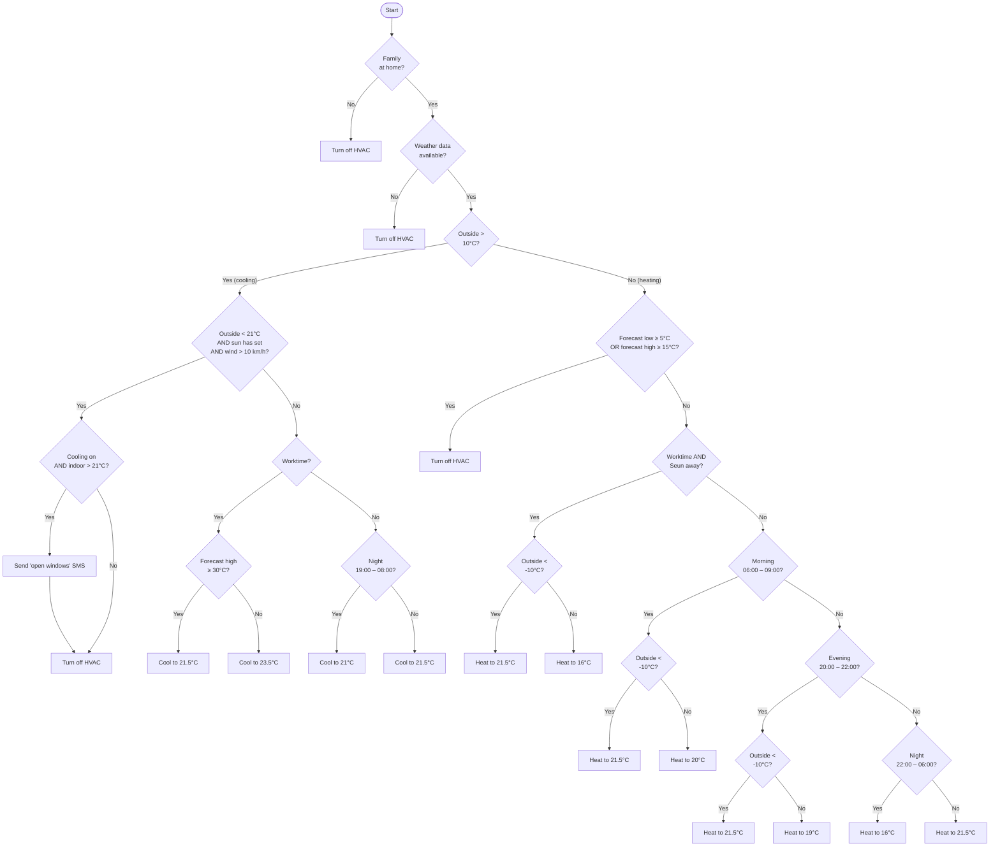

# Home Assistant HVAC Algorithm

An intelligent thermostat automation script for Home Assistant that controls a Nest Learning Thermostat based on occupancy, weather conditions, wind, sunset, and time-based schedules.

## Functionality

The script automatically adjusts HVAC settings based on multiple conditions:

- **Occupancy Control**: Turns off HVAC when family is away.
- **Weather-Based Logic**: Uses outside temperature to choose between heating and cooling strategies.
- **Schedule Awareness**: Different setpoints for work hours, daytime, morning, evening, and nighttime.
- **Natural Cooling**: When the outside temperature is below the night cooling target, the sun has set, and there's enough wind to ventilate, the system turns off the AC and sends an SMS suggesting the windows be opened.
- **Forecast Integration**: Disables heating when the daily forecast predicts warm weather.
- **Deep Cold Override**: When the current outside temperature drops below a deep-cold threshold, the heating target is bumped up to the standard daytime comfort temperature, overriding more conservative work/morning/evening targets.
- **Wild Heat Override**: When the forecast high reaches a wild-heat threshold, the worktime cooling target is dropped to the standard daytime comfort temperature for more aggressive cooling.
- **Presence Detection**: Adjusts heating during work hours based on individual presence.

## Decision Flow

## Configuration Variables

| Variable                             |  Default | Description                                                                       |
|--------------------------------------|---------:|-----------------------------------------------------------------------------------|
| `cooling_day_setpoint_c`             |   21.5°C | Default cooling temperature during daytime                                        |
| `cooling_day_start_time`             | 08:00:00 | Time when cooling daytime schedule begins                                         |
| `cooling_night_setpoint_c`           |     21°C | Cooling temperature during nighttime                                              |
| `cooling_night_start_time`           | 19:00:00 | Time when cooling nighttime schedule begins                                       |
| `cooling_work_setpoint_c`            |   23.5°C | Cooling temperature during work hours                                             |
| `heating_morning_setpoint_c`         |     20°C | Heating temperature during morning hours                                          |
| `heating_morning_start_time`         | 06:00:00 | Time when heating morning schedule begins                                         |
| `heating_day_setpoint_c`             |   21.5°C | Default heating temperature during daytime                                        |
| `heating_day_start_time`             | 09:00:00 | Time when heating daytime schedule begins                                         |
| `heating_evening_setpoint_c`         |     19°C | Heating temperature during evening hours                                          |
| `heating_evening_start_time`         | 20:00:00 | Time when heating evening schedule begins                                         |
| `heating_night_setpoint_c`           |     16°C | Heating temperature during late night                                             |
| `heating_night_start_time`           | 22:00:00 | Time when heating nighttime schedule begins                                       |
| `heating_work_setpoint_c`            |     16°C | Heating temperature during work hours (when away)                                 |
| `seasonal_mode_switch_temp_c`        |     10°C | Outside temperature threshold for switching between heating and cooling modes     |
| `seasonal_deep_cold_switch_temp_c`   |    -10°C | Outside temperature below which heating is boosted to the daytime comfort target  |
| `forecast_high_warm_threshold_c`     |     15°C | Forecast high temperature threshold for disabling heating                         |
| `forecast_low_warm_threshold_c`      |      5°C | Forecast low temperature threshold for disabling heating                          |
| `forecast_wild_heat_threshold_c`     |     30°C | Forecast high threshold for dropping worktime cooling to the daytime target       |
| `natural_cooling_wind_threshold_kmh` | 10 km/h  | Minimum wind speed required to consider natural cooling viable                    |

## Dependencies

### Required Entities
- `climate.nest_learning_thermostat` - Main thermostat control
- `binary_sensor.family_status` - Home/away occupancy detection
- `weather.winnipeg_forecast` - Weather data source
- `sensor.winnipeg_temperature` - Current outdoor temperature
- `sensor.winnipeg_high_temperature` - Daily high temperature forecast
- `sensor.winnipeg_low_temperature` - Daily low temperature forecast
- `sensor.winnipeg_wind_speed` - Current wind speed in km/h
- `sensor.sun_next_setting` - Timestamp of the next sunset (used to detect whether today's sunset has already passed)
- `sensor.nest_learning_thermostat_temperature` - Indoor temperature
- `binary_sensor.worktime_sensor` - Work hours detection
- `device_tracker.seunphone_unifi` - Individual presence tracking for Seun

### Services
- `notify.mobile_app_vadimiphone` - SMS notification service for natural-cooling alerts

## Installation

1. Place the script in your Home Assistant scripts configuration.
2. Ensure all required entities are properly configured.
3. Customize the variables to match your preferences.
4. Test the automation across different times of day, weather conditions, and presence states.
